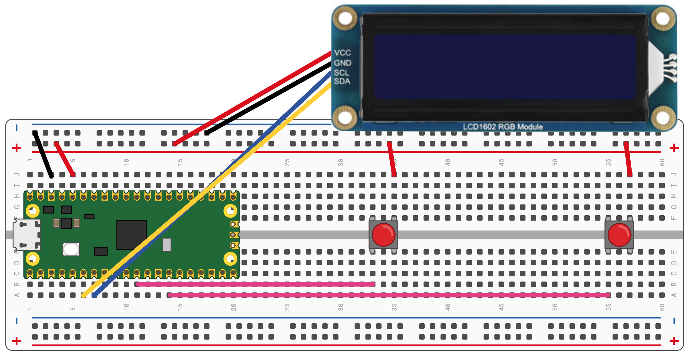

# Click Counter

## Components

- Raspberry Pi Pico (+ usb cable, breadboard and jumper wires).
- 2 push buttons
- I2C LCD1602 RGB Display.

## Function

The click counter shows on the screen the number of clicks made with a button. There is a second button for reset counter to 0.

## Connections

Wire diagram:

Left button is button #1 and right button is #2.
